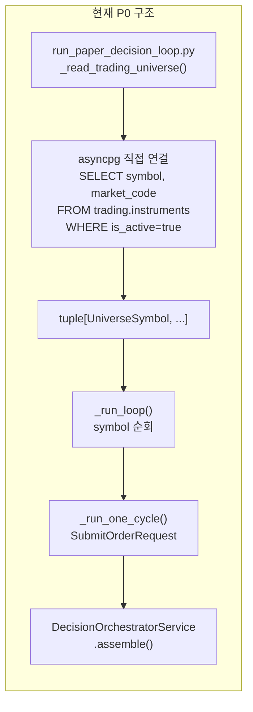
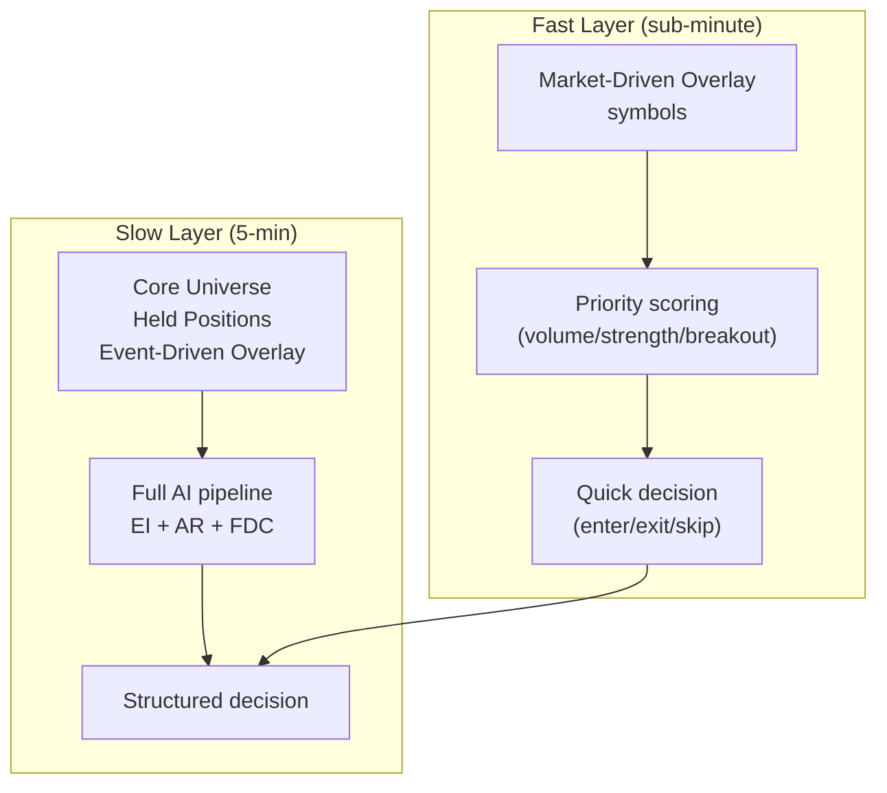
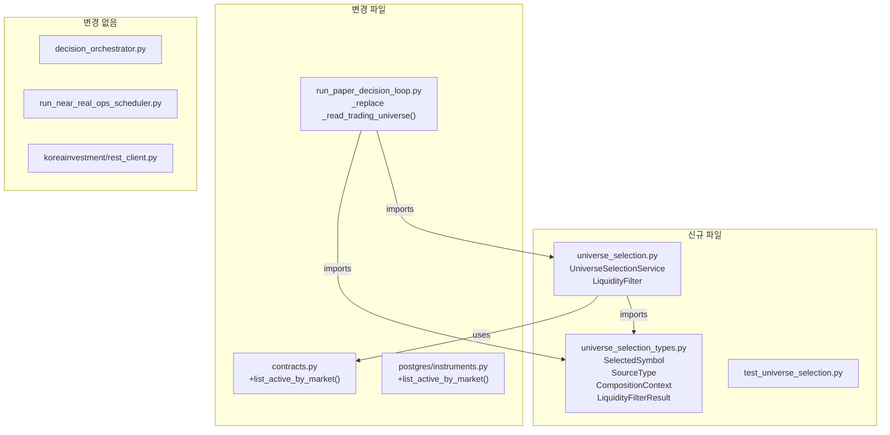

# Universe Selection Service P1 설계안

> **목적**: `plans/trading_universe_policy_v1.md` V1.1 정책과 `plans/BACKLOG.md` #28, #30을 코드로 옮기기 위한 설계.  
> **상태**: ❌ 미구현 — 이 문서는 설계 및 변경 범위 고정이 목적  
> **참조**: [`trading_universe_policy_v1.md`](plans/trading_universe_policy_v1.md), [`BACKLOG.md` #28](plans/BACKLOG.md#L90), [`BACKLOG.md` #30](plans/BACKLOG.md#L92)  
> **기준 코드**: [`run_paper_decision_loop.py`](scripts/run_paper_decision_loop.py), [`contracts.py`](src/agent_trading/repositories/contracts.py), [`decision_orchestrator.py`](src/agent_trading/services/decision_orchestrator.py), [`rest_client.py`](src/agent_trading/brokers/koreainvestment/rest_client.py)

---

## 목차

1. [목표 및 비목표](#1-목표-및-비목표)
2. [현재 구조의 한계](#2-현재-구조의-한계)
3. [입력 소스 정의](#3-입력-소스-정의)
4. [합성 규칙](#4-합성-규칙)
5. [Liquidity Filter 설계](#5-liquidity-filter-설계)
6. [Inclusion Reason / source_type 데이터 모델](#6-inclusion-reason--source_type-데이터-모델)
7. [Fast Layer / Slow Layer 정책](#7-fast-layer--slow-layer-정책)
8. [권장 코드 변경 사항](#8-권장-코드-변경-사항)
9. [P1 최소 구현 범위](#9-p1-최소-구현-범위)
10. [P2+ 확장 방향](#10-p2-확장-방향)
11. [위험 및 검증 계획](#11-위험-및-검증-계획)

---

## 1. 목표 및 비목표

### 목표 (P1 Scope)

| # | 목표 | 세부 |
|---|------|------|
| G1 | `Instrument Master` ↔ `Trading Universe` 명시적 분리 | 현재 `_read_trading_universe()`가 직접 DB 조회 + 단순 fallback. 이를 전용 Service 계층으로 분리 |
| G2 | 4개 입력 소스 합성 | Core Universe + Held Positions + Event-Driven Overlay + Market-Driven Overlay |
| G3 | Market-Driven Overlay 기반 설계 | KIS ranking API 인터페이스 정의 (실제 API 연동은 P2) |
| G4 | Liquidity Filter 구현 | Tick size / volume / market cap / micro-cap / 이상체결 deterministic pre-gate |
| G5 | Inclusion Reason / source_type 기록 | 최종 Universe 심볼별 `source_type`과 `inclusion_reason`을 `UniverseSymbol`에 반영 |
| G6 | Fast Layer / Slow Layer Policy 정의 | Market-driven 종목은 Fast Layer 우선 scoring. Core/Event-driven 종목은 Slow Layer |
| G7 | Daily Cap + Budget Preservation 유지 | 기존 예산 정책 변경 없음 |

### 비목표 (P1에서 하지 않을 것)

- ❌ 실제 KIS ranking API HTTP 연동 (인터페이스 정의만, stub 구현)
- ❌ AI 기반 universe scoring (P2)
- ❌ Strategy Relevance Filter (Layer 3) 알고리즘 구현
- ❌ `ExternalEventRepository` polling worker 구현 (기존 foundation 그대로 사용)
- ❌ 신규 DB migration (code-level selector로 P1 구현, P2에서 DB 스키마 검토)
- ❌ Admin UI universe 상태 표시

---

## 2. 현재 구조의 한계

### 2.1 실행 경로 분석



### 2.2 구체적 한계점

| # | 한계 | 영향 | 관련 코드 |
|---|------|------|-----------|
| L1 | `_read_trading_universe()`가 DB의 **모든** active KRX 종목을 무조건 로드 | 선택/필터링 없이 100종목 전량 투입 | [`_read_trading_universe()`](scripts/run_paper_decision_loop.py:189) |
| L2 | inclusion reason / source_type 미존재 | 어떤 종목이 왜 universe에 포함됐는지 추적 불가 | [`UniverseSymbol`](scripts/run_paper_decision_loop.py:86) (symbol, market만 있음) |
| L3 | KIS ranking API 미연동 | Market-Driven Overlay (거래량 급증, 체결강도, 신고가 등) 구현 불가 | [`KIS_ENDPOINTS`](src/agent_trading/brokers/koreainvestment/rest_client.py:51) |
| L4 | Liquidity Filter 부재 | 저유동성/이상체결 종목이 그대로 decision loop 진입 | [`InstrumentRepository`](src/agent_trading/repositories/contracts.py:179) |
| L5 | Fast/Slow Layer 미분리 | 모든 종목이 동일한 5분 주기로 평가 | [`_run_loop()`](scripts/run_paper_decision_loop.py:572) |
| L6 | `InstrumentRepository.list_active_by_market()` 미구현 | `_read_trading_universe()`가 raw asyncpg로 우회 | [`PostgresInstrumentRepository`](src/agent_trading/repositories/postgres/instruments.py:11) |
| L7 | `_read_trading_universe()`가 script 레벨 함수 | 재사용 불가. Scheduler/API에서 universe 조회 불가 | [`_read_trading_universe()`](scripts/run_paper_decision_loop.py:189) |

---

## 3. 입력 소스 정의

### 3.1 Core Universe

| 항목 | 값 |
|------|-----|
| **정의** | 전략이 항상 평가해야 하는 기준 종목 집합 |
| **P1 데이터** | `trading.instruments` WHERE `market_code='KRX'` AND `is_active=true` AND 특정 조건 |
| **조건** | KOSPI200 구성 종목 (향후 명시적 목록). P1에서는 전체 active KRX |
| **갱신 주기** | Slow Layer (매 cycle 5분) |
| **출처** | `InstrumentRepository.list_active_by_market('KRX')` |

### 3.2 Held Positions

| 항목 | 값 |
|------|-----|
| **정의** | 현재 계좌가 보유 중인 포지션. 매도/증분/관리 목적으로 반드시 universe에 포함 |
| **P1 데이터** | `PositionSnapshotRepository.list_latest_by_account()` |
| **조건** | quantity > 0인 모든 포지션 |
| **갱신 주기** | 매 cycle (snapshot sync 이후) |
| **비고** | 보유 종목은 `inclusion_reason='held_position'`으로 별도 표시. Cap에서 제외 (mandatory) |

### 3.3 Event-Driven Overlay

| 항목 | 값 |
|------|-----|
| **정의** | 외부 이벤트(OpenDART 공시, 뉴스, macro)가 발생한 종목. 중요 이벤트 발생 시 즉시 평가 대상 |
| **P1 데이터** | `ExternalEventRepository.list_by_symbol()` / `list_by_type()` |
| **조건** | `severity='high'` 또는 `direction != 'neutral'` 이벤트 발생 종목. P1에서는 단순 시간 기준 최근 N시간 |
| **갱신 주기** | Event ingestion loop 완료 후 (현재 5분). 향후 event-driven trigger |
| **비고** | P1에서는 `ExternalEventRepository` foundation protocol 사용. 실제 polling worker는 기존 그대로 |

### 3.4 Market-Driven Overlay

| 항목 | 값 |
|------|-----|
| **정의** | KIS ranking/분석 API 기반 시장 동향 (거래량 급증, 체결강도 상위, 신고가 근접, 가격/거래대금 돌파) |
| **P1 데이터** | **Stub 구현** — 실제 KIS API는 P2. P1에서는 Mock/stub data로 인터페이스만 검증 |
| **조건** | P1에서는 Core Universe 내에서 ranking 상위 N% |
| **갱신 주기** | Fast Layer (매 cycle 1분 이내). P1에서는 5분 유지 |
| **비고** | 이 소스가 Fast Layer의 핵심 트리거 |

### 3.5 소스 우선순위

```
Core Universe (base) 
  → Held Positions (mandatory override) 
  → Event-Driven Overlay (additive, severity 기준) 
  → Market-Driven Overlay (additive, ranking 기준)
  → Exclusion Rules (제외)
  → Priority Sort
  → Daily Cap
```

---

## 4. 합성 규칙

### 4.1 단계별 합성 절차

```
Step 1: Core Universe 로드 (DB active KRX)
Step 2: Held Positions 로드 (account_id 기준)
Step 3: Event-Driven Overlay 로드 (since=last_event_ingestion, severity=high)
Step 4: Market-Driven Overlay 로드 (ranking API → top N)
Step 5: Exclusion Rules 적용 (is_active=false, 거래정지, 관리종목, micro-cap)
Step 6: Priority 정렬 (held > event > market > core)
Step 7: Daily Cap 적용 (cap=20-30, held 제외)
```

### 4.2 중복 처리 규칙

| 상황 | 처리 |
|------|------|
| 동일 symbol이 core + held | `source_type='held_position'` 우선. inclusion_reason 병합 |
| 동일 symbol이 core + event | `source_type='event_overlay'` 우선 (event가 override) |
| 동일 symbol이 core + market | `source_type='market_overlay'` 우선 |
| 동일 symbol이 event + market | `source_type='event_overlay'` 우선 (event 중요도 우선) |
| 동일 symbol이 held + anything | `source_type='held_position'` 최우선 (mandatory) |

### 4.3 Decision Loop 진입 규칙

```python
# Pseudo-code for universe composition
async def compose_universe(
    repos: RepositoryContainer,
    account_id: UUID,
    since: datetime,
    market_ranking_stub: list[str] | None = None,  # P2: actual KIS ranking
) -> list[SelectedSymbol]:
    seen: dict[str, SelectedSymbol] = {}
    
    # Step 1: Core Universe
    for inst in await repos.instruments.list_active_by_market("KRX"):
        seen[inst.symbol] = SelectedSymbol(
            symbol=inst.symbol,
            market=inst.market_code,
            source_type="core",
            inclusion_reason="kospi200_core",
        )
    
    # Step 2: Held Positions (mandatory override)
    for pos in await repos.positions.list_latest_by_account(account_id):
        if pos.quantity > 0:
            seen[pos.symbol] = SelectedSymbol(
                symbol=pos.symbol,
                market=pos.market_code,
                source_type="held_position",
                inclusion_reason="held_position_mandatory",
            )
    
    # Step 3: Event-Driven Overlay
    for event in await repos.external_events.list_by_type("disclosure", since):
        if event.symbol and event.symbol in seen:
            seen[event.symbol] = seen[event.symbol]._replace(
                source_type="event_overlay",
                inclusion_reason=f"high_importance_event:{event.event_type}",
            )
    
    # Step 4: Market-Driven Overlay (P1: stub, P2: KIS ranking)
    if market_ranking_stub:
        for sym in market_ranking_stub:
            if sym not in seen:
                seen[sym] = SelectedSymbol(
                    symbol=sym, market="KRX",
                    source_type="market_overlay",
                    inclusion_reason="volume_surge_ranking",
                )
    
    # Step 5: Exclusion Rules
    result = [s for s in seen.values() if await _pass_liquidity_filter(s, repos)]
    
    # Step 6: Priority Sort
    result.sort(key=_priority_key)
    
    # Step 7: Daily Cap (held excluded from cap count)
    capped = _apply_daily_cap(result, cap=30)
    return capped
```

---

## 5. Liquidity Filter 설계

### 5.1 필터 규칙 (Deterministic Pre-Gate)

| 규칙 | 조건 | 판정 |
|------|------|------|
| Tick Size Filter | `tick_size > (price * 0.001)` → 호가 단위가 가격 대비 너무 큼 | ❌ EXCLUDE |
| Accumulated Volume Filter | 최근 N일 평균 거래량 < threshold | ❌ EXCLUDE |
| Market Cap Floor | 시가총액 < threshold (KRX: 500억) | ❌ EXCLUDE |
| Micro-Cap Exclusion | 자본금 < threshold 또는 가격 < 1,000원 | ❌ EXCLUDE |
| Abnormal Execution Filter | 당일 거래량이 평균 대비 100배 초과 (이상체결 의심) | ❌ EXCLUDE |
| 거래정지/관리종목 | inquire-price 응답의 `iscd_stat_cls_code` 확인 | ❌ EXCLUDE |

### 5.2 P1 구현 범위

| 규칙 | P1 구현 | 데이터 출처 |
|------|---------|-------------|
| Tick Size Filter | **구현** — `InstrumentEntity.tick_size` 사용 | `trading.instruments` |
| Micro-Cap Exclusion | **구현** — 가격 < 1,000원 (최소 가격 기준) | KIS inquire-price (또는 stub) |
| 거래정지/관리종목 | **구현** — KIS inquire-price 응답 확인 (stub 가능) | KIS inquire-price |
| Accumulated Volume | **P2** — 거래량 이력 필요 | KIS ranking API |
| Market Cap Floor | **P2** — 시가총액 데이터 필요 | KIS 기본종목정보 |
| Abnormal Execution | **P2** — 이상체결 탐지 로직 | KIS 실시간/조회 |

### 5.3 인터페이스

```python
@dataclass(slots=True, frozen=True)
class LiquidityFilterResult:
    passed: bool
    fail_reason: str | None = None  # "tick_size_too_large" | "micro_cap" | "suspended" | ...

class LiquidityFilter(Protocol):
    async def check(self, symbol: str, market: str) -> LiquidityFilterResult:
        ...
```

---

## 6. Inclusion Reason / source_type 데이터 모델

### 6.1 `UniverseSymbol` 확장 (P1)

현재 [`UniverseSymbol`](scripts/run_paper_decision_loop.py:86)은 `symbol`, `market` 필드만 존재.  
P1에서 `source_type`과 `inclusion_reason`을 추가:

```python
@dataclass(slots=True, frozen=True)
class UniverseSymbol:
    symbol: str
    market: str = "KRX"
    source_type: str = "core"        # core | held_position | event_overlay | market_overlay | manual
    inclusion_reason: str = ""       # "kospi200_core" | "held_position_mandatory" | 
                                     # "high_importance_event:disclosure" | 
                                     # "volume_surge_top10" | "manual_watchlist"
    priority: int = 0                # Lower = higher priority (0=held, 1=event, 2=market, 3=manual, 4=core)
```

### 6.2 source_type enum 정의

```python
class SourceType(str, Enum):
    CORE = "core"                    # Core Universe (KOSPI200 등 기준)
    HELD_POSITION = "held_position"  # 보유 포지션 (mandatory)
    EVENT_OVERLAY = "event_overlay"  # Event-Driven (OpenDART 등)
    MARKET_OVERLAY = "market_overlay"  # Market-Driven (KIS ranking)
    MANUAL = "manual"                # 수동 watchlist (향후)
```

### 6.3 inclusion_reason 값 목록

| Reason 값 | source_type | 설명 |
|-----------|-------------|------|
| `kospi200_core` | core | KOSPI200 구성 종목 (P1: 전체 active KRX) |
| `held_position_mandatory` | held_position | 보유 포지션 (매도/증분 필요) |
| `high_importance_event:{event_type}` | event_overlay | 중요 공시/뉴스 발생 |
| `volume_surge_top10` | market_overlay | 거래량 급증 상위 |
| `trade_strength_top10` | market_overlay | 체결강도 상위 |
| `near_high_breakout` | market_overlay | 신고가 근접 |
| `price_volume_breakout` | market_overlay | 가격/거래대금 돌파 |
| `manual_watchlist` | manual | 운영자 수동 지정 |

---

## 7. Fast Layer / Slow Layer 정책

### 7.1 Layer 구분



### 7.2 P1 정책

| Layer | 대상 | 평가 주기 | AI Agent 호출 |
|-------|------|-----------|---------------|
| Fast Layer | `source_type='market_overlay'` | 매 cycle 우선 평가 (1분 목표) | Stub (지금과 동일) |
| Slow Layer | `source_type` in `core, held_position, event_overlay` | 5분 주기 | Full EI + AR + FDC |

### 7.3 Fast Layer 평가 규칙 (P1)

1. Market-Driven Overlay 편입 종목은 universe list에서 **앞쪽**에 배치 (`priority` 필드로 정렬)
2. Fast Layer 종목은 동일한 5분 cycle 내에서 먼저 평가
3. Fast Layer 종목이 Slow Layer 종목보다 **먼저** decision loop 진입
4. P1에서는 동일한 stub agent로 평가하지만, 실행 순서만 조정
5. P2에서 Fast Layer 전용 lightweight scoring 도입 검토

---

## 8. 권장 코드 변경 사항

### 8.1 파일별 변경 요약

```
신규 파일:
  src/agent_trading/services/universe_selection.py   (핵심)
  src/agent_trading/services/universe_selection_types.py  (dataclass)
  tests/services/test_universe_selection.py           (테스트)

변경 파일:
  src/agent_trading/repositories/contracts.py         (+ list_active_by_market, LiquidityFilter protocol)
  src/agent_trading/repositories/postgres/instruments.py  (+ list_active_by_market 구현)
  scripts/run_paper_decision_loop.py                  (_read_trading_universe → service 호출)
  src/agent_trading/domain/entities.py                (+ SourceType enum, optional)
  
참고만 (변경 불필요):
  src/agent_trading/services/decision_orchestrator.py   (변경 없음)
  scripts/run_near_real_ops_scheduler.py                (변경 없음)
  src/agent_trading/brokers/koreainvestment/rest_client.py (P2에서 ranking API 추가)
```

### 8.2 상세 변경 명세

#### 8.2.1 신규: `src/agent_trading/services/universe_selection_types.py`

```python
"""Universe Selection Service type definitions."""

from __future__ import annotations
from dataclasses import dataclass
from datetime import datetime
from decimal import Decimal
from enum import Enum
from uuid import UUID


class SourceType(str, Enum):
    CORE = "core"
    HELD_POSITION = "held_position"
    EVENT_OVERLAY = "event_overlay"
    MARKET_OVERLAY = "market_overlay"
    MANUAL = "manual"


@dataclass(slots=True, frozen=True)
class SelectedSymbol:
    symbol: str
    market: str
    source_type: SourceType
    inclusion_reason: str
    priority: int = 3  # 0=held(최우선) ~ 3=core(기본)


@dataclass(slots=True, frozen=True)
class CompositionContext:
    account_id: UUID
    since: datetime
    max_cap: int = 30
    exclude_held_from_cap: bool = True


@dataclass(slots=True, frozen=True)
class LiquidityFilterResult:
    passed: bool
    fail_reason: str | None = None
```

#### 8.2.2 신규: `src/agent_trading/services/universe_selection.py`

```python
"""Universe Selection Service — P1 implementation.

Separates instrument master → trading universe into a dedicated service layer.
Composes 4 input sources, applies Liquidity Filter, records inclusion reason/source_type.
"""

from __future__ import annotations

from agent_trading.repositories.container import RepositoryContainer
from agent_trading.services.universe_selection_types import (
    CompositionContext,
    LiquidityFilterResult,
    SelectedSymbol,
    SourceType,
)


class LiquidityFilter:
    """Deterministic pre-gate for universe candidates.
    
    P1 implements: tick_size filter, micro-cap exclusion, suspended/managed exclusion.
    P2 adds: accumulated volume, market cap floor, abnormal execution detection.
    """
    
    def __init__(self, repos: RepositoryContainer) -> None:
        self._repos = repos
    
    async def check(self, symbol: str, market: str) -> LiquidityFilterResult:
        instrument = await self._repos.instruments.get_by_symbol(symbol, market)
        if instrument is None:
            return LiquidityFilterResult(False, "unknown_instrument")
        if not instrument.is_active:
            return LiquidityFilterResult(False, "inactive_instrument")
        # P1 tick_size heuristic: exclude if tick_size > 1000 (micro-cap indicator)
        if instrument.tick_size is not None and instrument.tick_size >= Decimal("1000"):
            return LiquidityFilterResult(False, "tick_size_too_large")
        return LiquidityFilterResult(True)


class UniverseSelectionService:
    """Compose the trading universe from 4 input sources.
    
    Flow
    ----
    1. Core Universe (DB active KRX instruments)
    2. Held Positions (account positions, mandatory override)
    3. Event-Driven Overlay (ExternalEventRepository, severity=high)
    4. Market-Driven Overlay (KIS ranking stub, P2)
    5. Exclusion Rules (LiquidityFilter)
    6. Priority Sort
    7. Daily Cap
    """
    
    def __init__(
        self,
        repos: RepositoryContainer,
        liquidity_filter: LiquidityFilter | None = None,
    ) -> None:
        self._repos = repos
        self._liquidity_filter = liquidity_filter or LiquidityFilter(repos)
    
    async def compose(self, ctx: CompositionContext) -> list[SelectedSymbol]:
        """Compose the final trading universe for a single decision cycle."""
        seen: dict[str, SelectedSymbol] = {}
        
        # Step 1: Core Universe
        await self._add_core_universe(seen)
        
        # Step 2: Held Positions
        await self._add_held_positions(seen, ctx)
        
        # Step 3: Event-Driven Overlay
        await self._add_event_overlay(seen, ctx)
        
        # Step 4: Market-Driven Overlay (P1: stub)
        await self._add_market_overlay(seen, ctx)
        
        # Step 5: Exclusion Rules (Liquidity Filter)
        candidates = await self._apply_exclusions(seen)
        
        # Step 6: Priority Sort
        candidates.sort(key=lambda s: s.priority)
        
        # Step 7: Daily Cap
        return self._apply_cap(candidates, ctx)
    
    async def _add_core_universe(
        self, seen: dict[str, SelectedSymbol]
    ) -> None:
        instruments = await self._repos.instruments.list_active_by_market("KRX")
        for inst in instruments:
            if inst.symbol not in seen:
                seen[inst.symbol] = SelectedSymbol(
                    symbol=inst.symbol,
                    market=inst.market_code,
                    source_type=SourceType.CORE,
                    inclusion_reason="kospi200_core",
                    priority=3,
                )
    
    async def _add_held_positions(
        self, seen: dict[str, SelectedSymbol], ctx: CompositionContext
    ) -> None:
        positions = await self._repos.positions.list_latest_by_account(ctx.account_id)
        for pos in positions:
            if pos.quantity > 0:
                seen[pos.symbol] = SelectedSymbol(
                    symbol=pos.symbol,
                    market=pos.market_code or "KRX",
                    source_type=SourceType.HELD_POSITION,
                    inclusion_reason="held_position_mandatory",
                    priority=0,
                )
    
    async def _add_event_overlay(
        self, seen: dict[str, SelectedSymbol], ctx: CompositionContext
    ) -> None:
        events = await self._repos.external_events.list_by_type(
            "disclosure", ctx.since
        )
        for event in events:
            if event.symbol and event.severity == "high":
                seen[event.symbol] = SelectedSymbol(
                    symbol=event.symbol,
                    market=event.market or "KRX",
                    source_type=SourceType.EVENT_OVERLAY,
                    inclusion_reason=f"high_importance_event:{event.event_type}",
                    priority=1,
                )
    
    async def _add_market_overlay(
        self, seen: dict[str, SelectedSymbol], ctx: CompositionContext
    ) -> None:
        """P1 stub: no-op. P2 will call KIS ranking API here."""
        _ = ctx  # unused in P1
        pass
    
    async def _apply_exclusions(
        self, seen: dict[str, SelectedSymbol]
    ) -> list[SelectedSymbol]:
        result: list[SelectedSymbol] = []
        for sym in seen.values():
            lf = await self._liquidity_filter.check(sym.symbol, sym.market)
            if lf.passed:
                result.append(sym)
            else:
                logger.debug("Excluded %s/%s: %s", sym.symbol, sym.market, lf.fail_reason)
        return result
    
    @staticmethod
    def _apply_cap(
        candidates: list[SelectedSymbol], ctx: CompositionContext
    ) -> list[SelectedSymbol]:
        if not ctx.exclude_held_from_cap:
            return candidates[:ctx.max_cap]
        
        capped: list[SelectedSymbol] = []
        held_count = 0
        for sym in candidates:
            if sym.source_type == SourceType.HELD_POSITION:
                capped.append(sym)
                held_count += 1
            elif len(capped) - held_count < ctx.max_cap:
                capped.append(sym)
            else:
                break
        return capped
```

#### 8.2.3 변경: `src/agent_trading/repositories/contracts.py`

`InstrumentRepository` protocol에 메서드 추가:

```python
class InstrumentRepository(Protocol):
    # ... existing methods ...
    
    async def list_active_by_market(
        self, market_code: str
    ) -> Sequence[InstrumentEntity]:
        """List all active instruments for a given market code.
        
        This is the primary method used by UniverseSelectionService
        to build the Core Universe. Returns only is_active=true instruments.
        """
        ...
```

`LiquidityFilter` protocol 추가 (선택 사항 — P1에서는 class로 직접 구현):

```python
class LiquidityFilter(Protocol):
    async def check(self, symbol: str, market: str) -> LiquidityFilterResult:
        ...
```

#### 8.2.4 변경: `src/agent_trading/repositories/postgres/instruments.py`

```python
class PostgresInstrumentRepository:
    # ... existing methods ...
    
    async def list_active_by_market(
        self, market_code: str
    ) -> Sequence[InstrumentEntity]:
        rows = await self._tx.connection.fetch(
            """
            SELECT * FROM trading.instruments
            WHERE market_code = $1 AND is_active = true
            ORDER BY symbol
            """,
            market_code,
        )
        return [row_to_entity(row, InstrumentEntity) for row in rows]
```

#### 8.2.5 변경: `scripts/run_paper_decision_loop.py`

- `_read_trading_universe()` → `UniverseSelectionService.compose()` 호출로 대체
- `_run_loop()`에서 universe 획득 방식을 service 호출로 변경
- `UniverseSymbol` dataclass 확장 (source_type, inclusion_reason, priority 추가)
- 기존 `_parse_universe_symbols()`는 env var override용으로 유지 (env var가 가장 높은 우선순위)

변경 후 `_run_loop()`:

```python
async def _run_loop(
    *,
    interval: int,
    max_cycles: int,
    submit: bool,
    dry_run: bool,
    output: str,
) -> int:
    # ... 기존 로깅 ...
    
    # Priority 1: env var override
    raw = os.getenv(ENV_TRADING_UNIVERSE)
    if raw is not None and raw.strip():
        universe = _parse_universe_symbols(raw)
    else:
        # Priority 2: UniverseSelectionService
        async with postgres_runtime(run_migrations=False) as runtime:
            repos: RepositoryContainer = runtime["repositories"]
            selector = UniverseSelectionService(repos)
            # P1: account_id는 runtime에서 resolve하거나 default 사용
            account = await repos.accounts.find_one(...)
            ctx = CompositionContext(
                account_id=account.account_id if account else FALLBACK_ACCOUNT_ID,
                since=datetime.now(timezone.utc) - timedelta(hours=24),
            )
            selected = await selector.compose(ctx)
            universe = tuple(
                UniverseSymbol(
                    symbol=s.symbol,
                    market=s.market,
                    source_type=s.source_type.value,
                    inclusion_reason=s.inclusion_reason,
                    priority=s.priority,
                )
                for s in selected
            )
    
    # ... 나머지 로직 동일 ...
```

### 8.3 파일 매핑 다이어그램



---

## 9. P1 최소 구현 범위

### 9.1 우선순위별 구현 단위

| 우선순위 | 항목 | 파일 | 예상 변경량 |
|----------|------|------|-------------|
| **P0a** | `list_active_by_market()` protocol + Postgres 구현 | `contracts.py`, `instruments.py` | ~15줄 |
| **P0b** | `UniverseSymbol` 확장 (source_type, inclusion_reason, priority) | `run_paper_decision_loop.py` | ~10줄 |
| **P1a** | `universe_selection_types.py` 신규 | 신규 파일 | ~60줄 |
| **P1b** | `LiquidityFilter` class (tick_size + micro-cap heuristic) | `universe_selection.py` | ~30줄 |
| **P1c** | `UniverseSelectionService.compose()` core + held 구현 | `universe_selection.py` | ~80줄 |
| **P1d** | `_read_trading_universe()` → service 호출 교체 | `run_paper_decision_loop.py` | ~30줄 |
| **P1e** | Event-driven overlay (ExternalEventRepository 연결) | `universe_selection.py` | ~25줄 |
| **P1f** | Market-driven overlay stub (no-op, 인터페이스만) | `universe_selection.py` | ~10줄 |
| **P1g** | Daily Cap + priority sort | `universe_selection.py` | ~20줄 |
| **P1h** | 단위 테스트 | `test_universe_selection.py` | ~200줄 |

### 9.2 P1에서 하지 않을 것 (명시적 제외)

- ❌ KIS ranking API 실제 HTTP 연동 (인터페이스만 stub)
- ❌ 누적 거래량/시가총액 필터 (tick_size heuristic만)
- ❌ AI 기반 scoring (P2)
- ❌ 신규 DB migration (code-level selector)
- ❌ Fast Layer 전용 평가 로직 (실행 순서만 조정)

### 9.3 P1 완료 조건

```
[] list_active_by_market() 추가되어 InstrumentRepository protocol과 Postgres 구현 완료
[] UniverseSymbol에 source_type, inclusion_reason, priority 필드 추가
[] UniverseSelectionService.compose()가 4 source 합성 가능 (market_overlay는 stub)
[] LiquidityFilter가 tick_size 기반 제외 가능
[] Daily Cap 적용 (held_position 제외)
[] _read_trading_universe() 대체 (env var override 유지)
[] 기존 24개 테스트 모두 통과
[] 신규 UniverseSelectionService 테스트 10+ 통과
[] 100 symbols dry-run이 P0와 동일한 결과 출력
```

---

## 10. P2+ 확장 방향

### 10.1 P2 확장 항목

| 항목 | 설명 | 우선순위 |
|------|------|---------|
| KIS Ranking API 실제 연동 | `inquire-ranking` 또는 `inquire-volume-surge` 등 KIS API 추가. `_add_market_overlay()` stub 구현체 교체 | P2a |
| 누적 거래량 필터 | 최근 N일 평균 거래량 < threshold 제외 | P2b |
| 시가총액 필터 | 시가총액 < 500억 제외 (KIS 기본종목정보 필요) | P2b |
| 이상체결 탐지 | 당일 거래량 / 평균 거래량 > 100배 제외 | P2c |
| Fast Layer 전용 평가 | sub-minute lightweight scoring (volume/strength/breakout only) | P2c |
| DB migration | `universe_selection_runs` 또는 `daily_universe` 테이블 신규 검토 | P2d |
| Universe Selection Config | 전략별 core universe 목록, cap size, filter threshold를 env/config로 주입 | P2d |

### 10.2 P3+ 확장 후보

| 항목 | 설명 |
|------|------|
| AI 기반 universe scoring | LLM이 macro/sentiment 기반으로 universe 가중치 조정 |
| Replay 가능한 universe history | 과거 시점의 universe 구성 재현 |
| Admin UI universe 상태 표시 | 현재 universe 구성, inclusion reason, filter 통과 현황 |

---

## 11. 위험 및 검증 계획

### 11.1 위험 목록

| # | 위험 | 영향 | 완화 |
|---|------|------|------|
| R1 | Universe composition latency 증가 | 100 symbols 기준 5.4s → 증가 가능 | P1 composition은 cache-friendly. Core Universe는 매 cycle 재조회 불필요 |
| R2 | `SourceType` enum 추가로 기존 `UniverseSymbol` 하위 호환성 깨짐 | 기존 consumer 코드 | `source_type` 기본값 `"core"`, `inclusion_reason` 기본값 `""`, `priority` 기본값 `3` |
| R3 | Held Positions repository에 `market_code` 누락 | `SelectedSymbol.market` 기본값으로 KRX | `PositionSnapshotEntity`에 `market_code` 필드 확인 필요 |
| R4 | `_add_market_overlay()`가 stub으로 남아 실제 효과 검증 불가 | P1에서 market overlay 효과 없음 | P1에서는 core + held + event만으로도 현재보다 개선. Market overlay는 P2 |
| R5 | `list_active_by_market()`가 `postgres_runtime()` 내부에서만 호출 가능 | script 레벨 `_read_trading_universe()` 대체 시 connection 이슈 | `CompositionContext`를 `postgres_runtime()` context 내에서 생성 |
| R6 | `_parse_universe_symbols()` env var override와 service composition 충돌 | 혼란 | Env var는 최우선순위 유지. 설정 시 service bypass |

### 11.2 검증 계획

| 검증 | 방법 |
|------|------|
| P0 회귀 테스트 | 기존 24개 `test_run_paper_decision_loop.py` 테스트 전면 통과 |
| Universe composition 단위 테스트 | 4 source별 합성, 중복 처리, priority sort, cap 적용을 각각 검증 |
| Liquidity Filter 단위 테스트 | tick_size 필터, micro-cap heuristic, is_active=false 케이스 |
| 100-symbol dry-run 회귀 | P0와 동일한 `--count 1 --dry-run --output json` 결과 확인 |
| Env var override 동작 | `TRADING_UNIVERSE_SYMBOLS=005930,000660` 설정 시 service bypass 확인 |

### 11.3 질문에 대한 답변

**Q1. 신규 DB table vs code-level selector?**  
→ **P1: Code-level selector.** 신규 table 없이 `UniverseSelectionService`가 runtime에 composition.  
→ P2에서 `daily_universe` 테이블 검토 (replay/history 목적).

**Q2. P1에서 스키마 없이 가능?**  
→ **가능.** `InstrumentRepository.list_active_by_market()`, `PositionSnapshotRepository`, `ExternalEventRepository`는 모두 기존 protocol. 새 필드는 `UniverseSymbol` dataclass에만 추가.

**Q3. Input/Output contract?**  
→ **Input**: `CompositionContext(account_id, since, max_cap, exclude_held_from_cap)`  
→ **Output**: `list[SelectedSymbol]` (symbol, market, source_type, inclusion_reason, priority)

**Q4. Decision loop / scheduler 연결?**  
→ `_read_trading_universe()` 내부에서 service 호출. Scheduler는 `TRADING_UNIVERSE_SYMBOLS` env var를 설정하지 않으므로, decision loop이 자동으로 service composition 사용. Scheduler 변경 불필요.

**Q5. KIS API interface?**  
→ P1: stub (`_add_market_overlay()`는 no-op). P2: `KISRestClient`에 ranking API 메서드 추가 (`get_volume_ranking()`, `get_trade_strength_ranking()` 등). `KIS_ENDPOINTS`에 신규 endpoint 등록.

**Q6. Deterministic liquidity filter?**  
→ **가능.** P1은 `tick_size > 1000` heuristic + `is_active` + KIS `iscd_stat_cls_code` (inquire-price 활용, stub 가능). 모든 조건은 deterministic.

**Q7. Fast/Slow Layer 통합?**  
→ P1: `SelectedSymbol.priority` 필드로 정렬 순서만 조정. Market-driven 종목이 먼저 평가됨. P2에서 Fast Layer 전용 lightweight 평가 도입.

---

## 부록 A: `trading_universe_policy_v1.md`와의 정합성

| 정책 항목 | P1 구현 여부 | 비고 |
|-----------|-------------|------|
| Layer 1: Base Market Pool | ✅ Core Universe로 구현 | `list_active_by_market('KRX')` |
| Layer 2: Operational Eligibility | ✅ Liquidity Filter (일부) | tick_size + micro-cap heuristic |
| Layer 3: Strategy Relevance | ❌ P2 | 전략별 universe 분기 필요 |
| Layer 4: Market-Driven Overlay | ⚠️ P1 stub | 실제 KIS 연동은 P2 |
| Layer 4.1: Liquidity Filter | ✅ P1 기본 | tick_size, micro-cap, 거래정지 |
| Layer 4.2: Inclusion Reason | ✅ P1 구현 | source_type + inclusion_reason |
| Layer 5: Daily Execution Cap | ✅ P1 구현 | held_position 제외 cap |
| Step 1-7 구성 절차 | ✅ P1 구현 | 7-step composition |
| Fast Layer / Slow Layer | ⚠️ 실행 순서만 | 전용 평가는 P2 |
| 3-Layer 코드 분리 | ✅ P1 구현 | Instrument Master ↔ Universe Selection ↔ Decision Loop |

## 부록 B: 구현 후보 파일 요약

```
신규 (2개 파일):
  src/agent_trading/services/universe_selection.py         ~160줄
  src/agent_trading/services/universe_selection_types.py   ~60줄

변경 (3개 파일):
  src/agent_trading/repositories/contracts.py              +15줄
  src/agent_trading/repositories/postgres/instruments.py   +15줄
  scripts/run_paper_decision_loop.py                       +30줄 ~ -20줄

신규 테스트 (1개 파일):
  tests/services/test_universe_selection.py                ~200줄

총계: 신규 3파일, 변경 3파일, 약 460줄
```
