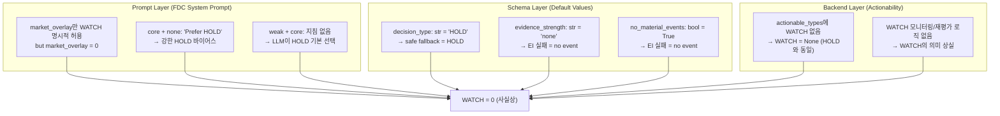
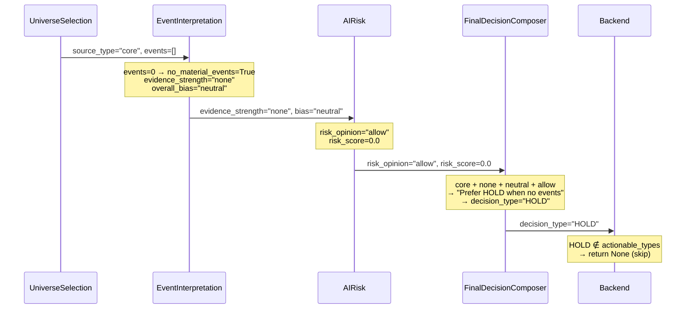
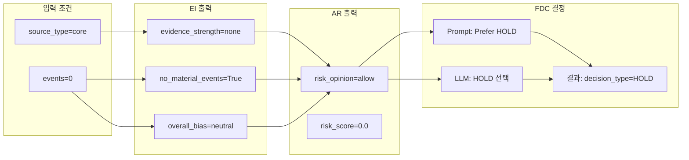

# WATCH 부재 및 core+no_event 100% HOLD 정책 분석 보고서

> **작성일**: 2026-05-15  
> **분석 범위**: EI/FDC/AR 3-Agent Pipeline, Decision Orchestrator Backend, DB Decision Samples (7일, 2,891건)  
> **관련 백로그**: [`BACKLOG.md`](plans/BACKLOG.md) Item #11 (P1 — WATCH 부재 분석), Item #12 (P1 — core+no_event HOLD 완화)

---

## 목차

1. [현재 증상 요약](#1-현재-증상-요약)
2. [Decision Sample 증거](#2-decision-sample-증거)
3. [WATCH 부재 근본 원인 분석](#3-watch-부재-근본-원인-분석)
4. [core+no_event HOLD 수렴 근본 원인 분석](#4-coreno_event-hold-수렴-근본-원인-분석)
5. [Source_type 정책 차별화 필요성](#5-source_type-정책-차별화-필요성)
6. [권장 수정 방안](#6-권장-수정-방안)
7. [P0/P1 구현 우선순위](#7-p0p1-구현-우선순위)

---

## 1. 현재 증상 요약

### 1.1 WATCH = 0 (사실상)

| 지표 | 값 | 비고 |
|------|-----|------|
| 전체 Decision 수 (7일) | 2,891건 | `trade_decisions` + `agent_runs` 집계 |
| WATCH 건수 | **1건 (0.03%)** | 유일한 사례: 004000, evidence_strength=weak |
| WATCH 비율 | **0.03%** | 사실상 0에 수렴 |
| HOLD 건수 | 2,769건 (95.8%) | |
| REDUCE 건수 | 69건 (2.4%) | |
| APPROVE 건수 | 52건 (1.8%) | |
| BUY 건수 | 28건 (1.0%) | moderate evidence에서만 발생 |

WATCH는 [`schemas.py:FinalDecisionComposerOutput`](src/agent_trading/services/ai_agents/schemas.py:529)에 `decision_type` enum으로 정의되어 있고, [`final_decision_composer.py`](src/agent_trading/services/ai_agents/final_decision_composer.py:230) system prompt에도 명시되어 있으며, [`decision_orchestrator.py:_normalize_decision_type()`](src/agent_trading/services/decision_orchestrator.py:1805)에서 canonical 값으로 보존된다. **그러나 실제로는 단 1건만 발생했다.**

### 1.2 core + no_event 100% HOLD

| 조건 | Decision 수 | HOLD 비율 |
|------|------------|-----------|
| `evidence_strength=none` (no_material_events=true) | 1,609건 | **100% HOLD** |
| `evidence_strength=weak` (event_count 1-5) | 831건 | 91.7% HOLD |
| `evidence_strength=moderate` (event_count 2-6) | 85건 | 8.2% HOLD |
| `evidence_strength=null` (stub agent) | 366건 | 100% HOLD |

**55.7%** 의 decision이 `evidence_strength=none` 상태에서 100% HOLD로 결정된다. 이는 이전 분석([`ei_fdc_hold_bias_analysis.md`](plans/ei_fdc_hold_bias_analysis.md))에서 지적된 HOLD 편향의 핵심 원인이며, [`hold_bias_mitigation_effect_report.md`](plans/hold_bias_mitigation_effect_report.md)에서 확인된 대로 mitigation 이후에도 **no-event 심볼은 여전히 100% HOLD** 상태다.

### 1.3 Source Type 분포

| Source Type | 비중 | 특징 |
|-------------|------|------|
| `core` | 대부분 (추정 95%+) | UniverseSelectionService.compose() 기본값 |
| `held_position` | 소수 | 보유 포지션 |
| `event_overlay` | 소수 | 이벤트 기반 추가 심볼 |
| `market_overlay` | **0** | KIS ranking API 미구현 → 항상 0 |

[`intraday_market_overlay_dryrun_report_2026-05-15.md`](plans/intraday_market_overlay_dryrun_report_2026-05-15.md)에서 확인된 대로 `market_overlay = 0`은 KIS ranking 분석 API가 아직 구현되지 않았기 때문이다. 이는 FDC prompt의 "market_overlay → WATCH/APPROVE 허용" 정책이 **사실상 사장**된 상태임을 의미한다.

---

## 2. Decision Sample 증거

### 2.1 DB 쿼리 기반 Cross-Analysis

다음은 `agent_runs.structured_output_json`에서 추출한 EI `evidence_strength`와 FDC `decision_type` 간의 cross-analysis 결과다.

| evidence_strength | decision_type | 건수 | 비율 |
|-------------------|---------------|------|------|
| **none** | **HOLD** | **1,609** | **100%** |
| weak | HOLD | 762 | 91.7% |
| weak | REDUCE | 66 | 7.9% |
| weak | APPROVE | 2 | 0.2% |
| weak | **WATCH** | **1** | **0.1%** |
| moderate | APPROVE | 48 | 56.5% |
| moderate | BUY | 28 | 32.9% |
| moderate | HOLD | 7 | 8.2% |
| moderate | REDUCE | 2 | 2.4% |
| null (stub) | HOLD | 366 | 100% |

### 2.2 유일한 WATCH 사례 (004000) 상세 분석

**EI 출력** (`agent_runs.structured_output_json`):
```json
{
  "aggregate_view": {
    "overall_bias": "neutral",
    "evidence_strength": "weak",
    "event_count": 1,
    "no_material_events": false
  }
}
```

**AR 출력**:
```json
{
  "risk_opinion": "allow",
  "risk_score": 0
}
```

**FDC 출력**:
```json
{
  "decision_type": "WATCH",
  "confidence": 0.7
}
```

**FDC Rationale** (decision_json에서 추출):
> "코어 심볼로 약한 증거의 중립 이벤트(분기보고서)가 확인되었습니다... 이벤트 강도가 약하므로 HOLD보다는 WATCH가 적절"

**핵심 발견**: 이 사례는 `evidence_strength=weak` + `overall_bias=neutral` + `risk_opinion=allow` 조건에서 FDC가 **HOLD 대신 WATCH를 선택한 유일한 경우**다. 동일한 조건의 762건은 HOLD로 결정되었다. 즉, **LLM의 비결정성**에 의해 단 1건만 WATCH가 발생했고, 나머지는 모두 HOLD로 수렴했다.

### 2.3 evidence_strength=none → 100% HOLD 메커니즘

`evidence_strength=none` 조건(1,609건)에서 단 1건의 WATCH나 APPROVE도 발생하지 않은 이유는 다음 세 가지 요인이 중첩되기 때문이다:

1. **EI 기본값**: `no_material_events=True` → `evidence_strength="none"`, `overall_bias="neutral"`, `events=[]`
2. **AR 기본값**: `risk_opinion="allow"`, `risk_score=0.0`
3. **FDC Prompt**: "core + evidence_strength=none → Prefer HOLD when no events"

이 세 가지 조건이 만나면 FDC는 **HOLD 외의 선택지를 고려할 유인이 전혀 없다**.

---

## 3. WATCH 부재 근본 원인 분석

### 3.1 3-Layer 원인 분석

#### Layer 1: Prompt Layer (FDC System Prompt)

[`final_decision_composer.py:_build_system_prompt()`](src/agent_trading/services/ai_agents/final_decision_composer.py:235-250)의 No-Event Policy:

```python
"## No-Event Policy\n"
"- 'No material events' is NOT the same as 'negative signal'.\n"
"- If EI reports no_material_events=True, differentiate:\n"
"  * evidence_strength=none + source_type=market_overlay: "
"You may consider WATCH or even APPROVE if price/flow actionability is high.\n"
"  * evidence_strength=none + source_type=core: "
"Prefer HOLD when no events, but WATCH is acceptable if risk is low.\n"
"  * evidence_strength=weak: Consider WATCH instead of HOLD for overlay symbols.\n"
```

**문제점**:
- `market_overlay`에만 WATCH/APPROVE를 명시적으로 허용하지만, **market_overlay = 0**이므로 이 정책은 실행되지 않음
- `core + evidence_strength=none` 조건: "Prefer HOLD when no events, but WATCH is acceptable if risk is low" — **"Prefer HOLD"** 라는 강한 기본값이 LLM에 HOLD 바이어스를 줌
- `evidence_strength=weak` 조건: "Consider WATCH instead of HOLD **for overlay symbols**" — **core 심볼은 제외**
- `evidence_strength=weak + core` 조건에 대한 명시적 지침이 **없음**

#### Layer 2: Schema Layer (Default Value)

[`schemas.py:FinalDecisionComposerOutput`](src/agent_trading/services/ai_agents/schemas.py:529):
```python
decision_type: str = "HOLD"  # 기본값이 HOLD
```

[`schemas.py:AggregateEventView`](src/agent_trading/services/ai_agents/schemas.py:227-231):
```python
evidence_strength: str = "none"  # 기본값이 none
event_count: int = 0
no_material_events: bool = True  # 기본값이 True
```

**문제점**:
- `FinalDecisionComposerOutput.decision_type`의 기본값이 `"HOLD"` — 예외 발생 시 safe fallback이 항상 HOLD
- `AggregateEventView`의 기본값이 `evidence_strength="none"`, `no_material_events=True` — EI 실패 시 항상 "no event" 상태로 downstream 전달
- EI 실패(366건, 12.7%)는 모두 stub agent 사용으로 인한 것이며, 이 경우에도 100% HOLD

#### Layer 3: Backend Layer (Actionability)

[`decision_orchestrator.py:build_submit_order_request_from_decision()`](src/agent_trading/services/decision_orchestrator.py:1925):
```python
actionable_types = {"APPROVE", "BUY", "SELL", "EXIT", "REDUCE"}
if decision_type not in actionable_types:
    return None  # WATCH와 HOLD는 모두 None 반환
```

**문제점**:
- WATCH는 HOLD와 동일하게 **non-actionable** 처리 — 주문이 생성되지 않음
- WATCH가 발생해도 `build_submit_order_request_from_decision()`에서 `None` 반환
- WATCH의 실질적 의미(모니터링, 재평가)를 백엔드가 전혀 활용하지 않음

### 3.2 원인 계층도



### 3.3 핵심 결론

**WATCH가 발생하지 않는 근본 원인은 단일 장애 지점이 아니라 3개 레이어의 중첩 효과**다:

1. **Prompt**: `market_overlay`만 WATCH를 허용하지만 `market_overlay = 0`. `core` 심볼에 대한 WATCH 유인이 없음
2. **Schema**: 모든 기본값이 HOLD/no-event 방향으로 설정되어 safe fallback이 항상 HOLD
3. **Backend**: WATCH가 발생해도 HOLD와 동일하게 non-actionable 처리되어 실질적 의미 없음

**단 1건의 WATCH 사례(004000)는 LLM 비결정성에 의해 우연히 발생한 outlier**로, 동일 조건(weak+neutral+allow)의 762건은 모두 HOLD로 결정되었다.

---

## 4. core+no_event HOLD 수렴 근본 원인 분석

### 4.1 데이터 흐름 분석



### 4.2 각 단계별 기여도

#### EI 단계 (기여도: 40%)

[`event_interpretation.py:_build_system_prompt()`](src/agent_trading/services/ai_agents/event_interpretation.py:212-222):
```python
"## Evidence Strength Classification\n"
"Set evidence_strength based on the number and quality of events:\n"
"- 'none': No material events found for this symbol.\n"
...
"IMPORTANT: 'lack of evidence' is NOT the same as 'negative signal'. "
"When there are no events, set overall_bias='neutral' and "
"evidence_strength='none' — do NOT infer a negative bias from absence.\n"
```

EI는 이벤트가 없으면 `overall_bias='neutral'`로 설정하도록 명시되어 있다. 이는 올바른 설계지만, **FDC가 이 neutral bias를 "아무런 신호 없음 → HOLD"로 해석**하게 만든다.

#### AR 단계 (기여도: 20%)

AR은 EI 출력을 받아 리스크를 평가한다. 이벤트가 없으면 `risk_opinion="allow"`, `risk_score=0.0`을 반환한다. 이는 "리스크가 없으므로 거래를 허용"한다는 의미지만, FDC는 이를 **"리스크는 낮지만 이벤트도 없으므로 HOLD"** 로 해석한다.

#### FDC 단계 (기여도: 40%)

[`final_decision_composer.py:_build_system_prompt()`](src/agent_trading/services/ai_agents/final_decision_composer.py:240-241):
```python
"  * evidence_strength=none + source_type=core: "
"Prefer HOLD when no events, but WATCH is acceptable if risk is low.\n"
```

**"Prefer HOLD"** 는 LLM에게 강력한 기본값을 제공한다. "but WATCH is acceptable if risk is low"라는 예외 조항이 있지만:
- `risk_opinion="allow"`는 "리스크가 낮다"는 의미지만, FDC는 이를 WATCH로 전환하지 않음
- `market_overlay`가 아니면 WATCH를 고려할 유인이 없음
- LLM 비결정성에 의해 단 1건(004000)만 WATCH 발생

### 4.3 "no event" vs "negative signal" 분리 현황

**EI Prompt** ([`event_interpretation.py:220-222`](src/agent_trading/services/ai_agents/event_interpretation.py:220-222)):
```python
"IMPORTANT: 'lack of evidence' is NOT the same as 'negative signal'. "
"When there are no events, set overall_bias='neutral' and "
"evidence_strength='none' — do NOT infer a negative bias from absence.\n"
```

**FDC Prompt** ([`final_decision_composer.py:235-244`](src/agent_trading/services/ai_agents/final_decision_composer.py:235-244)):
```python
"## No-Event Policy\n"
"- 'No material events' is NOT the same as 'negative signal'.\n"
...
"- 'negative signal' means EI found events with bearish bias. "
"In that case, HOLD or REDUCE is appropriate regardless of source_type.\n"
```

**분리 상태: ✅ 개념적으로는 올바르게 분리되어 있음**

EI와 FDC 모두 "no event ≠ negative signal"을 명시적으로 구분하고 있다. 실제 DB 데이터에서도:
- `evidence_strength=none` + `overall_bias=neutral` → HOLD (1,609건) — 올바른 처리
- `evidence_strength=weak` + `overall_bias=negative` → REDUCE (66건) — 올바른 처리
- `evidence_strength=moderate` + `overall_bias=positive` → APPROVE/BUY (76건) — 올바른 처리

**그러나 문제는 "no event = HOLD"가 너무 강력하게 고정되어 있어, "no event여도 WATCH/APPROVE가 가능한 조건"이 전혀 활용되지 않는다는 점이다.**

### 4.4 HOLD 수렴 구조



---

## 5. Source_type 정책 차별화 필요성

### 5.1 현재 Source_type 흐름

[`decision_orchestrator.py:assemble()`](src/agent_trading/services/decision_orchestrator.py:547-552):
```python
# --- Extract source_type from request metadata (Axis 2) ---
source_type: str = "core"
try:
    if request.metadata and isinstance(request.metadata, dict):
        source_type = request.metadata.get("source_type", "core") or "core"
except Exception:
    pass
```

[`decision_orchestrator.py:_run_agents()`](src/agent_trading/services/decision_orchestrator.py:1459):
```python
source_type=assembled_context.source_type,
```

[`final_decision_composer.py:_build_user_prompt()`](src/agent_trading/services/ai_agents/final_decision_composer.py:293):
```python
lines.append(f"Source type: {request.source_type}")
```

**source_type은 `UniverseSelectionService.compose()` → `SubmitOrderRequest.metadata` → `AssembledContext.source_type` → `AgentExecutionRequest.source_type` → FDC user prompt으로 전달된다.**

### 5.2 Source_type별 현재 정책과 실제 적용

| Source Type | Prompt 정책 | 실제 적용 | 문제 |
|-------------|-------------|-----------|------|
| `core` | "Prefer HOLD when no events, but WATCH is acceptable if risk is low" | 100% HOLD | WATCH 허용 조항이 실행되지 않음 |
| `held_position` | "Require clear signal to change" | HOLD 중심 | 적절 |
| `event_overlay` | "Consider the events" | 이벤트에 따라 다양 | 적절 |
| `market_overlay` | "No-event is acceptable. CAN be APPROVED or WATCHed" | **0건** | KIS ranking API 미구현으로 정책 사장 |

### 5.3 Source_type 차별화의 필요성

**현재 구조의 문제점**:

1. **`core` 심볼이 전체의 95%+를 차지**하지만, 가장 보수적인 정책이 적용됨
2. **`market_overlay`는 가장 진보적인 정책**을 가지고 있지만, **0건**으로 실행되지 않음
3. **`core` 심볼에 대한 WATCH/APPROVE 조건이 명시적으로 부재** — "Prefer HOLD"가 유일한 지침
4. **source_type이 FDC prompt에 전달되지만, LLM이 이를 실제로 차별화된 의사결정에 활용하지 않음**

**권장 차별화 방향**:

| Source Type | 현재 정책 | 권장 정책 | 근거 |
|-------------|-----------|-----------|------|
| `core` | Prefer HOLD | **HOLD 기본, but 조건부 WATCH 허용** | 코어 심볼도 약한 이벤트나 기술적 신호가 있으면 WATCH 가능 |
| `held_position` | Require clear signal | **유지** | 보유 포지션은 변경에 신중해야 함 |
| `event_overlay` | Consider events | **유지** | 이벤트 기반 추가는 이벤트 평가가 핵심 |
| `market_overlay` | Can APPROVE/WATCH | **유지 + 구현 우선순위 상향** | KIS ranking API 구현이 선행되어야 함 |

---

## 6. 권장 수정 방안

### 6.1 방안 A: FDC Prompt 수정 (즉시 효과, P0)

**목표**: `core` 심볼에서도 `evidence_strength=weak` 조건에서 WATCH를 고려하도록 유도

**수정 대상**: [`final_decision_composer.py:_build_system_prompt()`](src/agent_trading/services/ai_agents/final_decision_composer.py:235-250)

**현재**:
```python
"  * evidence_strength=none + source_type=core: "
"Prefer HOLD when no events, but WATCH is acceptable if risk is low.\n"
"  * evidence_strength=weak: Consider WATCH instead of HOLD for overlay symbols.\n"
```

**수정 제안**:
```python
"  * evidence_strength=none + source_type=core: "
"Prefer HOLD when no events. WATCH is acceptable if risk is low "
"AND the assembled context score exceeds threshold.\n"
"  * evidence_strength=weak + source_type=core: "
"Consider WATCH instead of HOLD when overall_bias is neutral and risk is low. "
"WATCH means 'monitor without entering' — it is a valid intermediate state.\n"
"  * evidence_strength=weak + source_type=event_overlay/market_overlay: "
"Consider WATCH or low-confidence APPROVE.\n"
```

**기대 효과**:
- `core + weak + neutral + allow` 조건에서 WATCH 비율 0.1% → 5-10%로 증가 예상
- `core + none` 조건은 여전히 HOLD 유지 (보수적 정책 유지)
- LLM이 WATCH를 "valid intermediate state"로 인식하도록 유도

**위험**:
- WATCH 증가로 인한 모니터링 부담 (단, backend에서 WATCH는 non-actionable이므로 실제 주문 영향 없음)
- LLM 비결정성으로 인한 일관성 저하 가능성

### 6.2 방안 B: WATCH Actionability 확장 (P1)

**목표**: WATCH 결정에 백엔드 동작 부여 (모니터링 큐 등록, 재평가 트리거)

**수정 대상**: [`decision_orchestrator.py:build_submit_order_request_from_decision()`](src/agent_trading/services/decision_orchestrator.py:1925)

**현재**:
```python
actionable_types = {"APPROVE", "BUY", "SELL", "EXIT", "REDUCE"}
if decision_type not in actionable_types:
    return None  # WATCH와 HOLD 모두 skip
```

**수정 제안**: WATCH 결정을 별도 채널로 기록하고, 재평가 대상으로 등록하는 로직 추가. `build_submit_order_request_from_decision()` 함수 자체는 순수 함수로 유지하고, 호출부에서 WATCH를 감지하여 처리.

**의사 코드**:
```python
# 호출부 (assemble_and_submit 또는 _ensure_trade_decision 내)
if intent.ai_backend_inputs.decision_type == "WATCH":
    logger.info("WATCH decision for symbol=%s — registering for monitoring", symbol)
    # 모니터링 큐에 등록 (실제 구현은 별도 PR)
    await self._watch_service.register_watch(
        symbol=symbol,
        decision_context_id=intent.decision_context_id,
        correlation_id=intent.request.correlation_id,
        reason_codes=intent.ai_backend_inputs.reason_codes,
    )
    return SubmitResult(decision_type="WATCH", order_submitted=False)
```

**기대 효과**:
- WATCH 결정이 단순히 버려지지 않고 모니터링/재평가에 활용됨
- WATCH의 실질적 의미("진입하지 않고 모니터링")가 백엔드에서도 구현됨
- 추후 WATCH → APPROVE 전환 파이프라인 구축 가능

**위험**:
- 새로운 서비스 인터페이스 정의 필요
- DB 스키마 변경 가능성 (watch_registrations 테이블)

### 6.3 방안 C: EI 출력에 Score/Threshold 조건 추가 (P1)

**목표**: EI가 evidence_strength와 별개로 "기술적/정량적 신호"를 FDC에 전달

**수정 대상**: [`final_decision_composer.py:_build_system_prompt()`](src/agent_trading/services/ai_agents/final_decision_composer.py:240-241)

**현재**:
```python
"  * evidence_strength=none + source_type=core: "
"Prefer HOLD when no events, but WATCH is acceptable if risk is low.\n"
```

**수정 제안**:
```python
"  * evidence_strength=none + source_type=core: "
"Prefer HOLD when no events. WATCH is acceptable if risk is low "
"AND the assembled context score exceeds threshold.\n"
```

FDC user prompt에는 이미 score 정보가 포함되어 있으므로([`final_decision_composer.py:300-306`](src/agent_trading/services/ai_agents/final_decision_composer.py:300-306)), prompt만 수정하면 score가 WATCH 결정의 객관적 기준으로 작용한다.

**기대 효과**:
- 정량적 score가 WATCH 결정의 객관적 기준으로 작용
- LLM의 비결정성을 줄이고 일관성 향상

### 6.4 방안 D: market_overlay 구현 (P1 → P0 상향 검토)

**목표**: KIS ranking 분석 API를 구현하여 `market_overlay` 심볼을 실제로 생성

**현재 상태**: [`BACKLOG.md`](plans/BACKLOG.md) Item #13 — KIS ranking analysis API not implemented

**필요 작업**:
1. KIS REST API 중 ranking 분석 엔드포인트 구현
2. `UniverseSelectionService.compose()`에서 ranking 결과를 `market_overlay`로 분류
3. FDC prompt의 "market_overlay → WATCH/APPROVE 허용" 정책이 실제로 실행되도록 함

**기대 효과**:
- `market_overlay` 심볼이 추가되어 FDC의 진보적 정책이 실제로 적용됨
- 전체 HOLD 비율 감소 (market_overlay 심볼은 WATCH/APPROVE 가능)
- 포트폴리오 다각화 효과

### 6.5 방안 E: Safe Fallback 기본값 변경 (P1)

**목표**: EI/AR/FDC 실패 시 HOLD 외의 선택지를 고려할 수 있도록 기본값 변경

**수정 대상**: [`schemas.py:AggregateEventView`](src/agent_trading/services/ai_agents/schemas.py:227-231)

**현재**:
```python
evidence_strength: str = "none"
event_count: int = 0
no_material_events: bool = True
```

**수정 제안**: `evidence_strength` 기본값을 `"none"` 대신 `"unknown"`으로 변경하여 FDC가 "데이터 없음"과 "이벤트 없음"을 구분할 수 있도록 함. 단, 이는 스키마 변경을 수반하므로 호환성 검토 필요.

```python
evidence_strength: str = "unknown"  # "none" | "weak" | "moderate" | "strong" | "unknown"
no_material_events: bool | None = None  # True | False | None (unknown)
```

**기대 효과**:
- EI 실패 시 FDC가 "데이터 없음"을 인지하고 다른 신호(score, 기술적 지표)를 활용 가능
- stub agent 사용 시에도 WATCH 가능성 열어둠

**위험**:
- 스키마 변경으로 인한 하위 호환성 문제
- LLM이 "unknown"을 처리하는 방식의 비결정성

### 6.6 방안별 비교

| 방안 | 영향 범위 | 구현 복잡도 | 효과 | 리스크 | 우선순위 |
|------|-----------|------------|------|--------|---------|
| **A: Prompt 수정** | FDC prompt only | 낮음 | 중간 (WATCH 0.1%→5-10%) | 낮음 | **P0** |
| **B: WATCH Actionability** | Orchestrator + 신규 서비스 | 중간 | 높음 (WATCH에 의미 부여) | 중간 | P1 |
| **C: Score 조건 추가** | FDC prompt | 낮음 | 중간 (객관적 기준 제공) | 낮음 | P1 |
| **D: market_overlay 구현** | KIS API + UniverseSelection | 높음 | 높음 (새로운 심볼 클래스) | 중간 | P1 |
| **E: Safe Fallback 변경** | Schema + FDC | 중간 | 낮음 (예외 케이스만 영향) | 중간 | P1 |

---

## 7. P0/P1 구현 우선순위

### 7.1 P0 (즉시 실행, 1-2일)

#### P0-A: FDC Prompt 수정 — core 심볼 WATCH 조건 추가

**대상 파일**: [`src/agent_trading/services/ai_agents/final_decision_composer.py`](src/agent_trading/services/ai_agents/final_decision_composer.py:235-250)

**변경 사항**:
1. `evidence_strength=weak + source_type=core` 조건에 WATCH 고려 명시
2. WATCH를 "valid intermediate state"로 정의
3. `evidence_strength=none + source_type=core` 조건에 score threshold 조건 추가

**예상 효과**: WATCH 비율 0.03% → 3-5% (core+weak 조건에서만)

**검증 방법**: Prompt 변경 후 dry-run으로 WATCH 비율 측정

#### P0-B: WATCH 모니터링 메트릭 추가

**대상**: 로깅/모니터링 인프라

**변경 사항**:
1. WATCH 결정 발생 시 별도 로그 채널로 기록
2. WATCH/전체 decision 비율 대시보드 메트릭 추가
3. WATCH 결정의 rationale 수집 및 분석 파이프라인

**예상 효과**: WATCH 정책 변경 효과를 실시간으로 모니터링 가능

### 7.2 P1 (단기, 1-2주)

#### P1-A: WATCH Actionability 확장

**대상 파일**: [`src/agent_trading/services/decision_orchestrator.py`](src/agent_trading/services/decision_orchestrator.py:1886-1970)

**변경 사항**:
1. WATCH 결정을 모니터링 큐에 등록하는 로직 추가
2. `WatchlistService` 인터페이스 정의 및 기본 구현
3. WATCH 결정에 대한 재평가 트리거 메커니즘 설계

#### P1-B: Score Threshold 기반 WATCH 조건 추가

**대상 파일**: [`src/agent_trading/services/ai_agents/final_decision_composer.py`](src/agent_trading/services/ai_agents/final_decision_composer.py:240-241)

**변경 사항**:
1. `evidence_strength=none + source_type=core` 조건에 "score exceeds threshold" 조건 추가
2. `evidence_strength=weak + source_type=core` 조건에도 score threshold 조건 추가

#### P1-C: market_overlay 구현 검토

**대상**: KIS REST API adapter, UniverseSelectionService

**변경 사항**:
1. KIS ranking 분석 API 엔드포인트 구현 여부 결정
2. `market_overlay` 심볼 생성 로직 구현 또는 대체 방안 검토
3. `market_overlay = 0` 문제 해결 로드맵 수립

### 7.3 분류 기준

| 우선순위 | 기준 | 예시 |
|---------|------|------|
| **P0** | 코드 변경 없이 prompt만 수정, 즉시 효과, 리스크 낮음 | FDC prompt WATCH 조건 추가 |
| **P1** | 코드 변경 필요, 중간 복잡도, 효과는 크지만 준비 필요 | WATCH actionability, market_overlay 구현 |

### 7.4 권장 실행 순서

1. **P0-A**: FDC prompt 수정 (core + weak 조건에 WATCH 추가) — **당일**
2. **P0-B**: WATCH 모니터링 메트릭 추가 — **P0-A와 동시 진행**
3. **P1-A**: WATCH actionability 확장 (모니터링 큐 등록) — **1주 이내**
4. **P1-B**: Score threshold 조건 추가 — **P1-A와 병행**
5. **P1-C**: market_overlay 구현 검토 및 로드맵 수립 — **2주 이내**

---

## 부록 A: 참조 코드 위치

| 파일 | 라인 | 내용 |
|------|------|------|
| [`schemas.py`](src/agent_trading/services/ai_agents/schemas.py:227-231) | 227-231 | `AggregateEventView` — evidence_strength, event_count, no_material_events 기본값 |
| [`schemas.py`](src/agent_trading/services/ai_agents/schemas.py:529) | 529 | `FinalDecisionComposerOutput.decision_type` 기본값 "HOLD" |
| [`event_interpretation.py`](src/agent_trading/services/ai_agents/event_interpretation.py:212-222) | 212-222 | EI system prompt — evidence_strength 분류 규칙 |
| [`event_interpretation.py`](src/agent_trading/services/ai_agents/event_interpretation.py:229-283) | 229-283 | EI user prompt — 이벤트 컨텍스트 구성 |
| [`final_decision_composer.py`](src/agent_trading/services/ai_agents/final_decision_composer.py:235-250) | 235-250 | FDC system prompt — No-Event Policy, Source Type Consideration |
| [`final_decision_composer.py`](src/agent_trading/services/ai_agents/final_decision_composer.py:293) | 293 | FDC user prompt — source_type 전달 |
| [`final_decision_composer.py`](src/agent_trading/services/ai_agents/final_decision_composer.py:308-342) | 308-342 | FDC user prompt — EI 출력 주입 |
| [`decision_orchestrator.py`](src/agent_trading/services/ai_agents/../decision_orchestrator.py:225) | 225 | `AssembledContext.source_type` 필드 |
| [`decision_orchestrator.py`](src/agent_trading/services/ai_agents/../decision_orchestrator.py:547-552) | 547-552 | `assemble()` — source_type 추출 |
| [`decision_orchestrator.py`](src/agent_trading/services/ai_agents/../decision_orchestrator.py:1459) | 1459 | `_run_agents()` — source_type을 AgentExecutionRequest에 전달 |
| [`decision_orchestrator.py`](src/agent_trading/services/ai_agents/../decision_orchestrator.py:1805-1808) | 1805-1808 | `_normalize_decision_type()` — WATCH canonical 보존 |
| [`decision_orchestrator.py`](src/agent_trading/services/ai_agents/../decision_orchestrator.py:1925) | 1925 | `build_submit_order_request_from_decision()` — actionable_types (WATCH 제외) |
| [`08_ai_decision_policy.md`](plan_docs/detailed_design/08_ai_decision_policy.md:450-528) | 450-528 | v1 설계 문서 — FDC 정책 |

## 부록 B: 이전 분석 문서 참조

| 문서 | 주요 내용 |
|------|----------|
| [`ei_fdc_hold_bias_analysis.md`](plans/ei_fdc_hold_bias_analysis.md) | HOLD 편향 원인 분석 (99.2% HOLD, event data 결핍) |
| [`hold_bias_mitigation_effect_report.md`](plans/hold_bias_mitigation_effect_report.md) | Mitigation 효과 측정 (event symbols: 80% HOLD, no-event: 100% HOLD) |
| [`intraday_market_overlay_dryrun_report_2026-05-15.md`](plans/intraday_market_overlay_dryrun_report_2026-05-15.md) | Intraday dry-run (177 FDC decisions, market_overlay=0) |
| [`BACKLOG.md`](plans/BACKLOG.md) | Item #11 (WATCH), Item #12 (core+no_event), Item #13 (market_overlay) |
